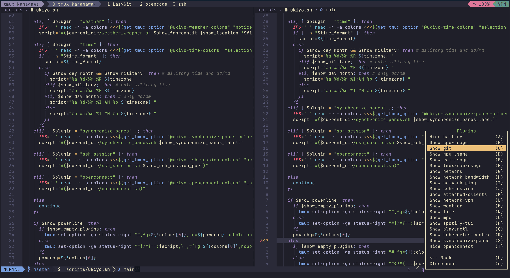
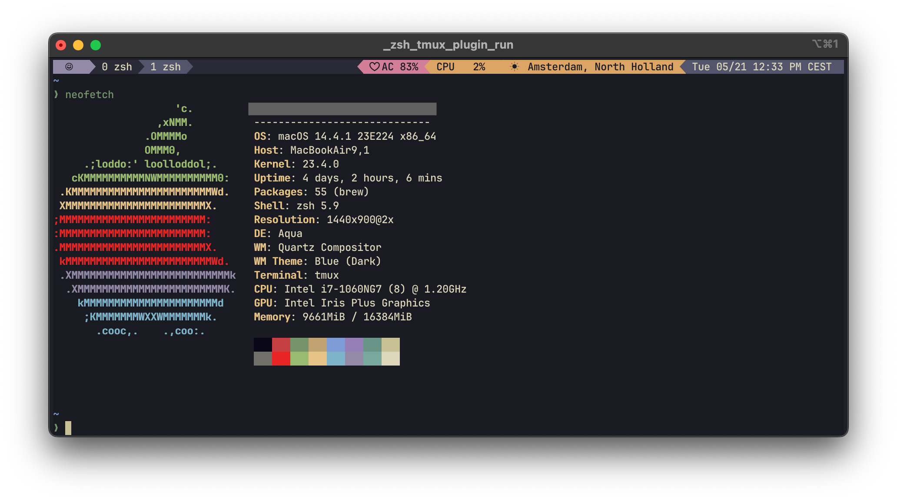
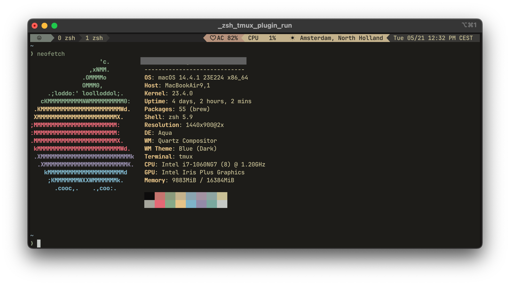
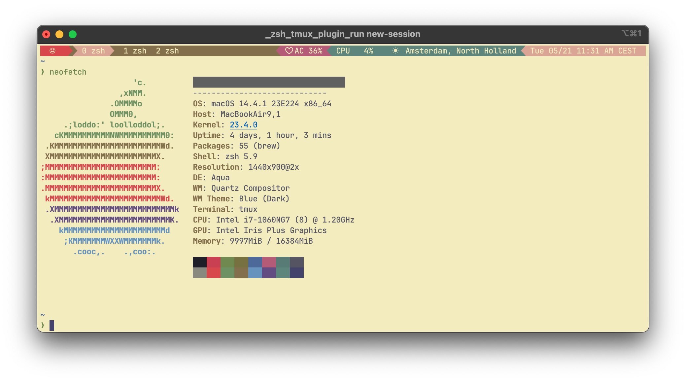

# Ukiyo for [tmux](https://github.com/tmux/tmux/wiki)

Multi-theme tmux status bar with [Kanagawa](https://github.com/rebelot/kanagawa.nvim), [Dracula](https://draculatheme.com/) [Tokyo Night](https://github.com/folke/tokyonight.nvim), and [Catppuccin](https://github.com/catppuccin/catppuccin) color schemes.

Forked from [dracula/tmux](https://github.com/dracula/tmux).



## Install

To activate the theme add the following line to your `.tmux.conf`.

    set -g @plugin 'Nybkox/tmux-ukiyo'

For advanced instructions look at [INSTALL.md](https://github.com/Nybkox/tmux-ukiyo/blob/master/INSTALL.md) or check official instructions of [dracula/tmux](https://draculatheme.com/tmux). Just replace all `dracula` occurrences with `ukiyo`.

## Configuration

Configuration and options can be found at [draculatheme.com/tmux](https://draculatheme.com/tmux).
Just replace all `dracula` occurrences with `ukiyo`.

Select a theme using `@ukiyo-theme` with format `theme/variant`. Press prefix+T for interactive menu.

```bash
# Kanagawa variants
set -g @ukiyo-theme "kanagawa/wave"    # default dark
set -g @ukiyo-theme "kanagawa/dragon"  # darker
set -g @ukiyo-theme "kanagawa/lotus"   # light

# Tokyo Night variants
set -g @ukiyo-theme "tokyonight/moon"   # default
set -g @ukiyo-theme "tokyonight/storm"
set -g @ukiyo-theme "tokyonight/night"  # darker

# Catppuccin variants
set -g @ukiyo-theme "catppuccin/mocha"      # default dark
set -g @ukiyo-theme "catppuccin/macchiato"  # medium dark
set -g @ukiyo-theme "catppuccin/frappe"     # muted dark
set -g @ukiyo-theme "catppuccin/latte"      # light

# Nord
set -g @ukiyo-theme "nord/default"

# Gruvbox variants
set -g @ukiyo-theme "gruvbox/dark"    # Dark
set -g @ukiyo-theme "gruvbox/light"   # Light

# Rose Pine variants
set -g @ukiyo-theme "rose-pine/main"    # Default dark
set -g @ukiyo-theme "rose-pine/moon"   # Dark, more muted
set -g @ukiyo-theme "rose-pine/dawn"   # Light

# Solarized variants
set -g @ukiyo-theme "solarized/dark"   # Dark
set -g @ukiyo-theme "solarized/light"  # Light

# OneDark variants
set -g @ukiyo-theme "onedark/dark"     # Dark
set -g @ukiyo-theme "onedark/darker"   # Darker
set -g @ukiyo-theme "onedark/cool"     # Cool (bluer tones)
set -g @ukiyo-theme "onedark/deep"     # Deepest background
set -g @ukiyo-theme "onedark/warm"     # Warm tones
set -g @ukiyo-theme "onedark/warmer"   # Warmer tones

# Bru variants
set -g @ukiyo-theme "bru/espresso"  # default dark
set -g @ukiyo-theme "bru/latte"     # light

# Legacy format still works
set -g @ukiyo-theme "wave"  # same as kanagawa/wave
```

If you want to preserve your emulator background / foreground for window:

```bash
set -g @ukiyo-ignore-window-colors true
```

### Nord

| Variant | Description |
| ------- | ----------- |
| default | Arctic, cool blue-grey |

### Gruvbox

| Variant | Description |
| ------- | ----------- |
| dark   | Retro groove, dark theme    |
| light  | Retro groove, light theme   |

### Rose Pine

| Variant | Description |
| ------- | ----------- |
| main   | Default dark theme    |
| moon   | Dark, more muted       |
| dawn   | Light mode             |

### Solarized

| Variant | Description |
| ------- | ----------- |
| dark   | Low contrast, precision colors |
| light  | Low contrast, precision colors |

### OneDark

| Variant | Description |
| ------- | ----------- |
| dark   | Standard dark              |
| darker | Lower contrast            |
| cool   | Bluer tones              |
| deep   | Deepest background        |
| warm   | Warmer tones             |
| warmer | Even warmer tones          |

### Kanagawa

| Variant | Description |
| ------- | ----------- |
| wave    | Default dark theme |
| dragon  | Darker variant     |
| lotus   | Light theme        |

**Wave** 
**Dragon** 
**Lotus** 

### Tokyo Night

| Variant | Description            |
| ------- | ---------------------- |
| moon    | Default, softer colors |
| storm   | Original dark theme    |
| night   | Darker backgrounds     |

### Custom Colors

Override any semantic color via `@ukiyo-color-<name>`. Accepts hex values or color variable names from the palette.

```bash
# Override with hex colors
set -g @ukiyo-color-accent "#00ff00"
set -g @ukiyo-color-bg-bar "#1a1a2e"

# Or use palette color names
set -g @ukiyo-color-accent "spring_green"
set -g @ukiyo-color-alert "samurai_red"

# Mix theme colors (e.g., use dragon colors in wave theme)
set -g @ukiyo-theme "wave"
set -g @ukiyo-color-bg-bar "dragon_black_4"
```

**Available semantic colors:**

| Name        | Role                           |
| ----------- | ------------------------------ |
| `text`      | Primary text/foreground        |
| `bg-bar`    | Status bar background          |
| `bg-pane`   | Window/pane background         |
| `highlight` | Active element highlight       |
| `selection` | Selected/focused element       |
| `info`      | Informational status           |
| `accent`    | Primary accent (VCS, success)  |
| `notice`    | Attention items (CPU, weather) |
| `error`     | Error states                   |
| `muted`     | Secondary status (battery)     |
| `alert`     | Prefix/alert active state      |

The Kanagawa theme for tmux also supports an extended list of colors from the Kaganawa color palette. Below, you'll find a detailed list of these extra colors available.

<details>
<summary><strong>Extended Color Palette</strong></summary>

| Color Name      | Hex Value | Visual                                                  |
| --------------- | --------- | ------------------------------------------------------- |
| Autumn Green    | `#76946a` |        |
| Autumn Orange   | `#dca561` |      |
| Autumn Red      | `#c34043` |            |
| Autumn Yellow   | `#dca561` |      |
| Boat Yellow 1   | `#938056` |      |
| Boat Yellow 2   | `#c0a36e` |      |
| Carp Yellow     | `#e6c384` |          |
| Crystal Blue    | `#7e9cd8` |        |
| Dragon Blue     | `#658594` |          |
| Dragon Green    | `#8a9a7b` |        |
| Dragon Aqua     | `#8ea4a2` |          |
| Dragon Orange   | `#b6927b` |      |
| Fuji Gray       | `#727169` |              |
| Fuji White      | `#dcd7ba` |            |
| Katana Gray     | `#717c7c` |          |
| Light Blue      | `#a3d4d5` |            |
| Old White       | `#c8c093` |              |
| Oni Violet      | `#957fb8` |            |
| Peach Red       | `#ff5d62` |              |
| Ronin Yellow    | `#ff9e3b` |        |
| Sakura Pink     | `#d27e99` |          |
| Samurai Red     | `#e82424` |          |
| Spring Blue     | `#7fb4ca` |          |
| Spring Green    | `#98bb6c` |        |
| Spring Violet 1 | `#938aa9` |  |
| Spring Violet 2 | `#9cabca` |  |
| Sumi Ink 0      | `#16161d` |            |
| Sumi Ink 1      | `#1e1f28` |            |
| Sumi Ink 2      | `#1a1a22` |            |
| Sumi Ink 3      | `#363646` |            |
| Sumi Ink 4      | `#2a2a37` |            |
| Sumi Ink 5      | `#363646` |            |
| Sumi Ink 6      | `#54546D` |            |
| Surimi Orange   | `#ffa066` |      |
| Wave Aqua       | `#6a9589` |              |
| Wave Aqua 2     | `#7aa89f` |          |
| Wave Blue 1     | `#223249` |          |
| Wave Blue 2     | `#2d4f67` |          |
| Wawe Red        | `#e46876` |                |
| Winter Blue     | `#252535` |          |
| Winter Green    | `#2b3328` |        |
| Winter Red      | `#43242b` |            |
| Winter Yellow   | `#49443c` |      |
| Lotus White 3   | `#f2ecbc` |      |
| Lotus Ink 1     | `#545464` |          |
| Lotus Ink 2     | `#43436c` |          |
| Lotus Red 2     | `#d7474b` |          |
| Lotus Yellow 2  | `#836f4a` |    |
| Lotus Teal 2    | `#6693bf` |        |
| Lotus Gray 3    | `#8a8980` |        |
| Lotus Pink      | `#b35b79` |            |
| Lotus Cyan      | `#d7e3d8` |            |
| Lotus Violet 1  | `#a09cac` |    |
| Lotus Violet 2  | `#766b90` |    |
| Lotus Orange    | `#cc6d00` |        |
| Lotus Orange 2  | `#e98a00` |    |
| Lotus Yellow    | `#77713f` |        |
| Lotus Yellow 2  | `#836f4a` |    |
| Lotus Yellow 3  | `#de9800` |    |
| Lotus Gray 2    | `#716e61` |        |
| Dragon Red      | `#c4746e` |            |
| Dragon Pink     | `#a292a3` |          |

</details><br>

For complete color lists, see [themes/kanagawa/palette.sh](./themes/kanagawa/palette.sh) and [themes/tokyonight/palette.sh](./themes/tokyonight/palette.sh).

## Features

- Support for powerline
- Day, date, time, timezone
- Current location based on network with temperature and forecast icon (if available)
- Network connection status, bandwidth and SSID
- SSH session user, hostname and port of active tmux pane
- Git branch and status
- Battery percentage and AC power connection status
- Refresh rate control
- CPU usage (percentage or load average)
- RAM usage (system and/or tmux server)
- GPU usage
- Disk usage
- Custom status texts from external scripts
- GPU VRAM usage
- GPU power draw
- Color code based on whether a prefix is active or not
- List of windows with the current window highlighted
- When prefix is enabled, a smiley face turns from green to yellow
- When charging, 'AC' is displayed
- If forecast information is available, a ☀, ☁, ☂, or ❄ unicode character corresponding with the forecast is displayed alongside the temperature
- Info if the Panes are synchronized
- Spotify playback (needs the tool spotify-tui installed)
- Music Player Daemon status (needs the tool mpc installed)
- Playerctl, get current track metadata
- Current kubernetes context
- Countdown to tmux-continuum save
- Current working directory of tmux pane
- OpenConnect VPN connection status

## Compatibility

Compatible with macOS and Linux. Tested on tmux 3.1b
FreeBSD compatibility is in development

## License

[MIT License](./LICENSE)
